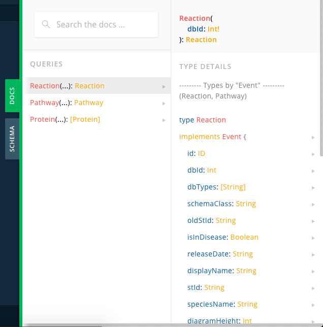
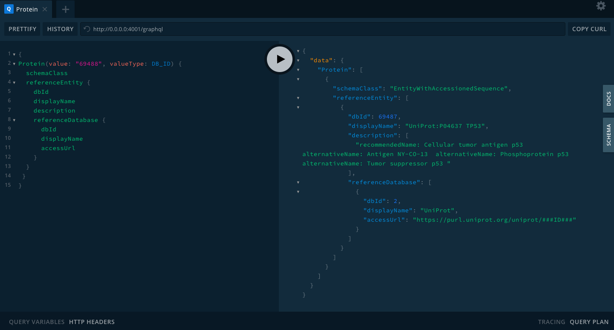

# GraphQL Interface For Querying Reactome Data

## PART - A: Project Setup

### 0. Install essentials
A. Install Docker (https://docs.docker.com/get-docker/) 

B. Install NodeJS (https://nodejs.org/en/download/)

### 1. Get Reactome's Neo4j database running 

A. Download Reactome's database: https://reactome.org/download/current/reactome.graphdb.tgz

B. Execute docker command:

```
docker run -p 7687:7687 -p 7474:7474 -e NEO4J_dbms_allow__upgrade=true -v $(pwd)/graph.db:/var/lib/neo4j/data/databases/graph.db neo4j:3.5.17
```

**Note:**

A. It is recommended to open the Neo4j database link in incognito mode to avoid cache problems

B. Default ```username = neo4j``` and ```password = neo4j```

C. Set and remember new password (which will be required in step 3)

### 2. Clone/Download project files and install dependencies

```
npm install
```

### 3. Configure credentials

Set your Neo4j connection string and credentials in `.env` file. For example:

**Note:** It is essential to change password value for the field **NEO4J_PASSWORD** to the new password value that was set in **1.Note.C** (above).

```
NEO4J_URI=bolt://localhost:7687
NEO4J_USER=neo4j
NEO4J_PASSWORD=reactome
```

### 4. Start the GraphQL service

a. Development mode:

```
npm run start:dev
```

b. Production mode:

```
npm start
```

This will start the GraphQL service (http://0.0.0.0:4001/graphql) where you can issue GraphQL requests by accessing GraphQL Playground in the browser.


## PART - B: Project Details

### 0. Description:
Reactome currently uses a REST-based API that allows end-users to obtain specific data from a set of predefined end-points. To provide better flexibility and allow users to query whatever data they need, this project provides a GraphQL interface to Reactome data fetched from a Neo4j database.

### 1. Tools Used:
1. GraphQL (https://graphql.org/)
2. JavaScript (https://developer.mozilla.org/en-US/docs/Web/JavaScript)
3. NodeJS (https://nodejs.org/en/)
4. Neo4j Database (https://neo4j.com/)

### 2. GraphQL Entrypoints:
There are three entrypoints in GraphQL Playground to query data from the Neo4j database:
1. Reaction 
2. Pathway 
3. Protein 


### 3. Querying Entrypoints Using Arguments
Reaction, Pathway and, Protein classes can be queries using two arguments and they are: 
1. value
2. valueType

**Note:** For the best querying experience make extensive use of keyboard shortcuts **option + space**/**command + space** to get auto-suggestions in GraphQL Playground. 


Example GraphQL Queries:

**Reaction:**
```
{
  Reaction(value: "482621", valueType: DB_ID) {
    schemaClass
    name
    dbTypes
    releaseDate
    displayName
  }
}
```

**Pathway:**
```
{
  Pathway(value: "109581", valueType: DB_ID) {
    dbId
    isInDisease
    displayName
    stId
    speciesName
  }
}
```

**Protein:**
```
{
  Protein(value: "109581", valueType: DB_ID) {
    dbId
    isInDisease
    displayName
    stId
    speciesName
    systematicName
  }
}
```

### 4. Accessing non-entrypoint classes from within entrypoint classes
The non-entrypoint classes can be accessed by using sub-queries within entrypoint classes. The following are some examples:

**Case 1:** Accessing ```Reference Entity``` class from ```Protein``` class
```
{
  Protein(value: "109581", valueType: DB_ID) {
    dbId
    displayName
    stId
    speciesName
    referenceEntity {
      dbId
      dbTypes
      name
    }
  }
}
```

**Case 2:** Accessing ```Catalyst``` class from ```Reaction``` class
```
{
  Protein(value: "109581", valueType: DB_ID) {
    dbId
    displayName
    stId
    speciesName
    referenceEntity {
      dbId
      dbTypes
      name
    }
  }
}
```

**Case 3:** Accessing ```Physical Entity``` class from ```Reaction``` class
```
{
  Reaction(value: "482621", valueType: DB_ID) {
    dbTypes
    schemaClass
    name
    input {
      name
      displayName
    }
    output {
      name
      displayName
    }
  }
}
```


It is recommended to make extensive use of docs and/or schema panel in the right section of GraphQL Playground to learn more about which properties are permitted to query from a particular schema class type or sub-query.




### 5. Abstract and Concrete classes using Interfaces and Types respectively
The Reactome database is hierarchical in nature. The top-level classes are often abstract whereas lower-level classes are usually concrete. Thus, in GraphQL the abstract classes are defined as ```Interface``` and others as ```Type```.

**What is an Interface?** 

Like many type systems, GraphQL supports interfaces. An Interface is an abstract type that includes a certain set of fields that a type must include to implement the interface. 

(Learn more about Interface here -> https://graphql.org/learn/schema/#interfaces)

Currently, there are three main Interfaces in Reactome GraphQL schema and their corresponding Type sub-classes are as follows:

1. **PhysicalEntity** 
   - Complex
   - Drug
   - Set
   - GenomeEncodedEntity
   - EntityWithAccessionedSequence
   - OtherEntity
   - Polymer
   - SimpleEntity
   - Protein

2. **Event** 
   - Reaction
   - Pathway

3. **ReferenceEntity** 
   - ReferenceGeneProduct
   - ReferenceMolecule 


**Querying using GraphQL inline-fragments:**

What is GraphQL inline-fragments? and why is it used? 

An inline-fragment is used when an interface type is returned by a query which could be any kind of concrete object that implements the interface. To access fields that exist on a concrete type that implements an interface but doesn't exist on the interface itself, an inline-fragment is needed to tell GraphQL what to retrieve for a specific concrete type.

**Case 1:** Accessing ```hasEvent``` relation on ```Pathway``` class
```
{
  Pathway(value: "109581", valueType: DB_ID) {
    hasEvent {
      schemaClass
      speciesName
      name
      ... on Pathway {
        hasEvent {
          schemaClass
          speciesName
          name
        }
      }
    }
  }
}
```

**Case 2:** Accessing ```Members``` class on ```Set``` class
```
{
  Reaction(value: "482621", valueType: DB_ID) {
    dbTypes
    schemaClass
    stId
    input {
      name
      ... on Set {
        members {
          name
        }
      }
    }
  }
}
```

## PART - C: Sample GraphQL Query Output Examples

 
**Output**
```
{
  "data": {
    "Protein": [
      {
        "dbId": 6813797,
        "name": [
          "Unfolded TP53",
          "Unfolded p53"
        ],
        "speciesName": "Homo sapiens",
        "stId": "R-HSA-6813797",
        "referenceEntity": [
          {
            "dbId": 69487,
            "displayName": "UniProt:P04637 TP53",
            "description": [
              "recommendedName: Cellular tumor antigen p53  alternativeName: Antigen NY-CO-13  alternativeName: Phosphoprotein p53  alternativeName: Tumor suppressor p53 "
            ]
          }
        ],
        "set": [
          {
            "dbId": 391287,
            "name": [
              "unfolded CCT/TRiC substrate candidates"
            ]
          }
        ]
      },
      {
        "dbId": 8869337,
        "name": [
          "TP53",
          "p53 protein",
          "P53_HUMAN",
          "Cellular tumor antigen p53",
          "Tumor suppressor p53",
          "Phosphoprotein p53",
          "Antigen NY-CO-13"
        ],
        "speciesName": "Homo sapiens",
        "stId": "R-HSA-8869337",
        "referenceEntity": [
          {
            "dbId": 69487,
            "displayName": "UniProt:P04637 TP53",
            "description": [
              "recommendedName: Cellular tumor antigen p53  alternativeName: Antigen NY-CO-13  alternativeName: Phosphoprotein p53  alternativeName: Tumor suppressor p53 "
            ]
          }
        ],
        "set": [
          {
            "dbId": 5690846,
            "name": [
              "RNF128,TRAF3,TRAF6,RHOA,TP53"
            ]
          }
        ]
      },
      

     . . .  Remaining Results Truncated . . .


    ]
  }
}
```

 
**Output**
```
{
  "data": {
    "Reaction": [
      {
        "catalyst": [
          {
            "dbId": 482613,
            "dbTypes": [
              "DatabaseObject",
              "CatalystActivity"
            ],
            "displayName": "nucleoside diphosphate kinase activity of NME1,2 hexamers [cytosol]",
            "stId": null,
            "schemaClass": "CatalystActivity",
            "physicalEntity": [
              {
                "dbId": 482610,
                "name": [
                  "NME1,2 hexamers",
                  "nucleotide diphosphate kinase hexamer"
                ]
              }
            ],
            "activeUnit": []
          }
        ]
      }
    ]
  }
}
```

 
**Output**
```
{
  "data": {
    "Pathway": [
      {
        "stId": "R-MMU-109606",
        "name": [
          "Intrinsic Pathway for Apoptosis"
        ],
        "dbId": 9787644,
        "dbTypes": [
          "DatabaseObject",
          "Event",
          "Pathway"
        ],
        "schemaClass": "Pathway",
        "hasEvent": [
          {
            "displayName": "Activation and oligomerization of BAK protein",
            "definition": null,
            "schemaClass": "Pathway",
            "stId": "R-MMU-111452"
          },
          {
            "displayName": "Activation of BH3-only proteins",
            "definition": null,
            "schemaClass": "Pathway",
            "stId": "R-MMU-114452"
          },
          {
            "displayName": "Activation, translocation and oligomerization of BAX",
            "definition": null,
            "schemaClass": "Pathway",
            "stId": "R-MMU-114294"
          },
          {
            "displayName": "Apoptotic factor-mediated response",
            "definition": null,
            "schemaClass": "Pathway",
            "stId": "R-MMU-111471"
          },
          {
            "displayName": "BH3-only proteins associate with and inactivate anti-apoptotic BCL-2 members",
            "definition": null,
            "schemaClass": "Pathway",
            "stId": "R-MMU-111453"
          },
          {
            "displayName": "Activation, myristolyation of BID and translocation to mitochondria",
            "definition": null,
            "schemaClass": "Pathway",
            "stId": "R-MMU-75108"
          }
        ]
      },


      . . .  Remaining Results Truncated . . .


    ]
  }
}
```

 
**Output**
```
{
  "data": {
    "Protein": [
      {
        "schemaClass": "EntityWithAccessionedSequence",
        "referenceEntity": [
          {
            "dbId": 69487,
            "displayName": "UniProt:P04637 TP53",
            "description": [
              "recommendedName: Cellular tumor antigen p53  alternativeName: Antigen NY-CO-13  alternativeName: Phosphoprotein p53  alternativeName: Tumor suppressor p53 "
            ],
            "referenceDatabase": [
              {
                "dbId": 2,
                "displayName": "UniProt",
                "accessUrl": "https://purl.uniprot.org/uniprot/###ID###"
              }
            ]
          }
        ]
      }
    ]
  }
}
```

 
**Output**
```
{
  "data": {
    "Reaction": [
      {
        "dbTypes": [
          "DatabaseObject",
          "Event",
          "ReactionLikeEvent",
          "Reaction"
        ],
        "schemaClass": "Reaction",
        "name": [
          "(d)NTP + ADP <=> (d)NDP + ATP (NME1,2,3)"
        ],
        "input": [
          {
            "name": [
              "ADP",
              "Adenosine 5'-diphosphate",
              "ADP(3-)"
            ],
            "displayName": "ADP [cytosol]"
          },
          {
            "name": [
              "(d)NTP",
              "(deoxy)nucleotide triphosphates"
            ],
            "displayName": "(d)NTP [cytosol]"
          }
        ],
        "output": [
          {
            "name": [
              "ATP",
              "Adenosine 5'-triphosphate",
              "ATP(4-)"
            ],
            "displayName": "ATP [cytosol]"
          },
          {
            "name": [
              "(d)NDP",
              "(deoxy)nucleotide diphosphates"
            ],
            "displayName": "(d)NDP [cytosol]"
          }
        ]
      }
    ]
  }
}
```

## PART - D: Future Work

**Task 1: Zero Setup GraphQL Playground**

Currently, to access GraphQL playground the user has to do a whole bunch of local setup i.e. to download Docker and NodeJS softwares, install NPM packages, download Reactome database, etc. 

So, the future work of this project would involve is to host these services directly to Heroku, Netlify or any other service providers and make available a direct link of Reactome's GraphQL Playground ready to query required data. 

For example, when a user visits **reactome.org/graphql** this should directly open Reactome's GraphQL Playground interface. 

**Task 2: FrontEnd Interface To Access Reactome Database**

Instead of accessing Reactome data programmatically from GraphQL playground, it is always better to access data using a user-friendly website interface. This will enhance and provide better UX and CX. 

So, the future work of this project should be to create a website using ReactJS to query data from Reactome's Neo4j database. 

The reason to use ReactJS is because it blends better with GraphQL. Both ReactJS and GraphQL are technologies created by Facebook to seamlessly work with each other.

Sample user-experience of this concept would be: 

a. User selects a Reactome class from list of all available classes from a dropdown menu. 

b. Then, valueType is selected from available valueTypes using the radio button. 

c. Then, value for corresponding valueType is entered into the search box.

d. Press 'Search' button on screen or press 'Enter' on keyboard and this will fetch required results from the backend. 

(This task can be one of the project ideas for the GSoC 2021:bulb:)